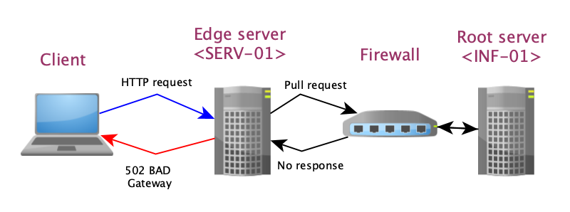

 <!-- .element height="50%" width="50%" -->
# ISSUE SUMMARY
    Start   :   10:57 (GMT +2) 
    End     :   11:30 (GMT +2)
    The Web site was unavailble and return : 502 Bad Gateway on nginx/1.14.2
    The root cause was a problem of the firewall configuration for information from server <SE-102> .

# TIME LINE
    13/05/2021  10h57 :  <TEAM-OF1> An alert was issue from our monitoring tool <SAVAGE version 1.2>.  
                11h05 :  <TEAM-OF1> Physical Checked up on Infrastructure server <INF-01>.  
                11h15 :  <TEAM-OF1> Port check up on server <EDG-01>, the firewall block all port.  
                11h20 :  <TEAM-OF1> Transfer to the IT security team <PROX-102>.  
                11h25 :  <PROX-102> Full port check up restablishement of the  communication.  
                11h30  : <TEAN-OF1> Web site available, incident close.  
# ROOT CAUSE AND RESOLUTION
    - CAUSES
        A new employee closed accidentally all port of the firewall.
    
    - RESOLUTION
        Restablishment of config <conf-02>.  
            To do it follow document </FireWall/ConfigurePort_V5.doc> which contain all needed open port.  
# CORRECTIVE AND PREVENTIVE ISSUE
    * Improve the formation of new employee with formation : <CP05FORM-BaseFireWall>.
    * Do not give full right on system without this formation.
    * Add warning message before validating change on the firewall.

